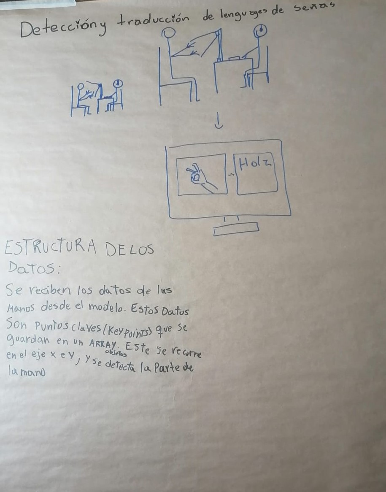

# hand_pose

<!-- WARNING: THIS FILE WAS AUTOGENERATED! DO NOT EDIT! -->

Idea del Proyecto:

La problemática que se quiere abordar es la de incapacidad de
comunicación entre una persona que se comunica utilizando lenguaje de
señas y una persona que no entiende o no sabe de lenguaje de señas.

Imágen del Papelógrafo:

<figure>

<figcaption aria-hidden="true">Imagen Papelógrafo</figcaption>
</figure>
